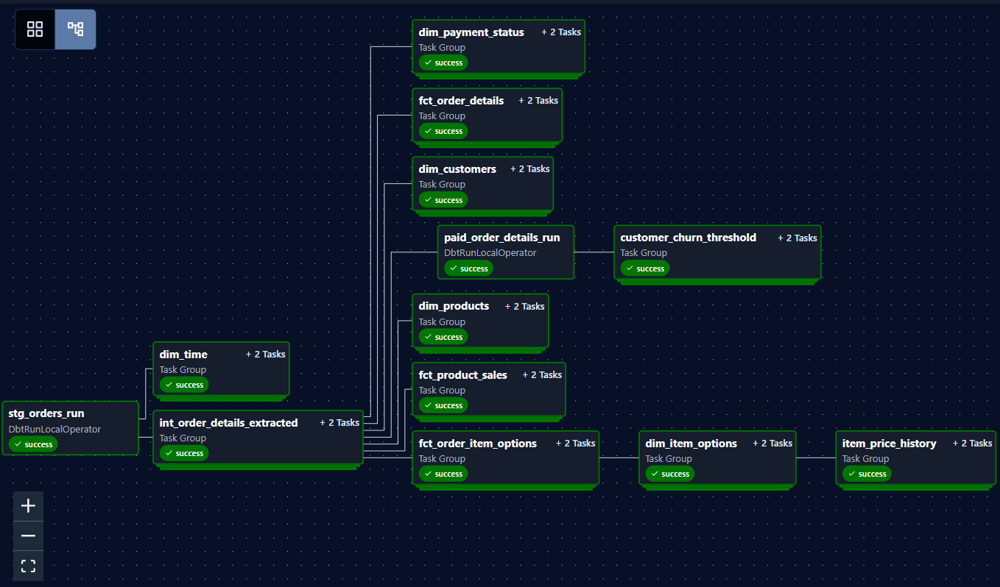

# Orchestrate dbt Models with Apache Airflow

<br>

## **Overview**

This project demonstrates how to orchestrate **dbt models** as a standalone data pipeline with [**Apache Airflow**](https://airflow.apache.org/docs/) using the [**Astronomer Cosmos**](https://github.com/astronomer/astronomer-cosmos) framework.

***Astronomer Cosmos*** is an open-source package that automatically creates Airflow tasks from dbt models. With Astro Cosmos, we can easily convert a dbt Core project into either a standalone Airflow DAG or a task group within a DAG.

In this project, we integrated our dbt modelling project, [**dbt_cafe_analytics**](../dbt_cafe_analytics), into an Astro Cosmos project folder, and configured it as a standalone Airflow DAG that is scheduled to run locally on a monthly basis.

<p align="center">
  
  <br>
  <em>Figure 1: A successful DAG run of dbt models in Airflow</em>
</p>

<br>

## **Project Structure**

The project folder was initialised with the [Astronomer CLI](https://www.astronomer.io/docs/astro/cli/overview) via the command:
```
astro dev init
```

The project now contains the following files and folders:

```jsx
astro-dbt-orchestration/
├── dags/
│   ├── dbt/
│   │   └── dbt_cafe_analytics/
│   ├── .airflowignore
│   └── cafe_analytics_dag.py
├── .astro/
│   ├── config.yaml
│   ├── dag_integrity_exceptions.txt
│   └── test_dag_integrity_default.py
├── assets/
│   └── airflow_dbt_dag.PNG
├── docker-compose.override.yml
├── .env
├── airflow_settings.yaml
├── requirements.txt
├── .dockerignore
├── Dockerfile
├── packages.txt
├── .gitignore
└── README.md
```

- **dags**:
    - **dbt/dbt_cafe_analytics**: Integrated dbt Core project folder containing models, tests, and configurations used for transformation logic.
    - **.airflowignore**: Defines files and directories that Airflow should skip when parsing DAGs.
    - **cafe_analytics_dag.py**: A Python file for the Airflow DAG to orchestrate dbt model execution.
- **.astro**:
    - **config.yaml**: An Astro project configuration file that specify environment settings and dependencies.
    - **dag_integrity_exceptions.txt**: Lists DAGs excluded from automatic integrity checks during validation.
    - **test_dag_integrity_default.py**: Default test file ensuring that all DAGs load correctly within the Astro environment.
- **assets**
    - **airflow_dbt_dag.PNG**: Image displaying the Airflow DAG lineage graph, used for README documentation.
- **docker-compose.override.yml**: Mounts local Application Default Credential (ADC) file into the Airflow container.
- **.env**: Stores local environment variables, including GCP authentication, project and dataset details, dbt profile settings, and a flag to enable or disable full-refresh runs.
- **airflow_settings.yaml**: Defines Airflow Connections, Variables, and Pools for local development, allowing consistent setup without manual configuration in the Airflow UI.
- **requirements.txt**: Lists all Python packages required to be installed for the project.
- **.dockerignore**: Specifies files and directories to exclude from the Docker build context.
- **Dockerfile**: Contains a versioned Astro Runtime Docker image that provides a differentiated Airflow experience, and specifies the commands to execute that install dbt adapators into the virtual environment.
- **packages.txt**: Lists OS-level dependencies to be installed in the container (empty by default).
- **.gitignore**:  Specifies files and folders that Git ignores in version control.
- **README.md**: Provides an overview, setup instructions, and documentation for the dbt orchestration project.

<br>

## Pre-requisites

Before setting up and running this project, ensure that the following dependencies are installed on your local machine:

- [**Docker Desktop**](https://www.docker.com/products/docker-desktop/) – Required to build and run the Astro and Airflow containers locally.
- [**Astronomer CLI**](https://www.astronomer.io/docs/astro/cli/install-cli) – Used to initialize, manage, and deploy the Astro project.

Once both are installed, verify your setup with:

```bash
docker --version
astro version
```

If both commands return version numbers without errors, you’re ready to start the project.

<br>

## **Deploy Project Locally**

Please follow the steps below to deploy the project locally with *Apache Airflow*:

### Step 1: Authenticate Astro to Google Cloud Platform (GCP)

#### Step 1.1: Locate your Application Default Credentials (ADC)

Find the location of your ADC file by following the Astronomer documentation:

👉 [Retrieve GCP user credentials locally](https://www.astronomer.io/docs/astro/cli/authenticate-to-gcp#retrieve-gcp-user-credentials-locally)

#### Step 1.2: Mount ADC into Airflow container

In the Astro project, configure the **`docker-compose.override.yml`**  with your local ADC location to mount the local ADC file into the Airflow container.

👉 [Configure your Astro project for GCP authentication](https://www.astronomer.io/docs/astro/cli/authenticate-to-gcp#configure-your-astro-project)

#### Step 1.3: Configure environment variables

Update **`.env`** file to include any environment variables required for GCP authentication and configurations required for dag files, such as `GOOGLE_APPLICATION_CREDENTIALS`

#### Step 1.4: Add a Google Cloud connection in Airflow

Add a *Google Cloud* connection in **`airflow_settings.yaml`**, which allows the DAG to interact with *GCP BigQuery* and other *GCP* services securely.

### Step 2: Install dbt adaptor into virtual environment

Add the following command to the **`Dockerfile`** to create a virtual environment named `dbt_venv` and install the `dbt-bigquery` adapter within it:

```docker
# Create a virtual environment and install dbt-bigquery
RUN python -m venv dbt_venv && source dbt_venv/bin/activate && \
    pip install --no-cache-dir dbt-bigquery && deactivate
```

### Step 3: Install Python packages required

Include the Python packages below in **`requirements.txt`** to install the required libraries and dependencies:

```
astronomer-cosmos
apache-airflow-providers-google  
dbt-bigquery
```

### Step 4: Start Airflow locally

Start Airflow on your local machine by running:
```
astro dev start
```

This command will spin up five Docker containers on your machine, each for a different Airflow component:

- Postgres: Airflow's Metadata Database
- Scheduler: The Airflow component responsible for monitoring and triggering tasks
- DAG Processor: The Airflow component responsible for parsing DAGs
- API Server: The Airflow component responsible for serving the Airflow UI and API
- Triggerer: The Airflow component responsible for triggering deferred tasks

When all five containers are ready the command will open the browser to the Airflow UI at http://localhost:8080/. You should also be able to access your Postgres Database at [localhost:5432/postgres](localhost:5432/postgres) with username ***postgres*** and password ***postgres***.

Note: If you already have either of the above ports allocated, you can either [stop your existing Docker containers or change the port](https://www.astronomer.io/docs/astro/cli/troubleshoot-locally#ports-are-not-available-for-my-local-airflow-webserver).

<br>

## **Deploy Your Project to Astronomer (Optional)**

If you have an Astronomer account, you can follow the Astronomer deployment guide here: 👉 [Deploy your project on Astronomer](https://www.astronomer.io/docs/astro/deploy-code/).

<br>